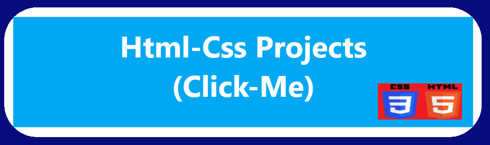
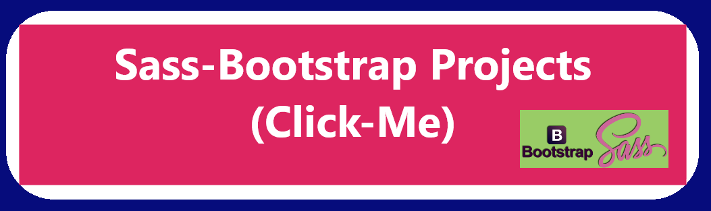
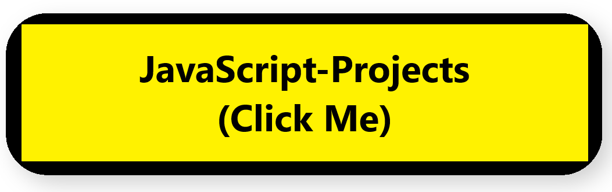
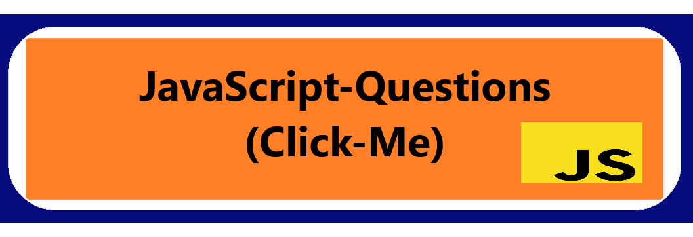
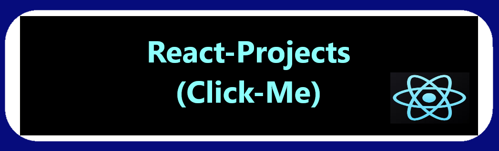

 

## :wave: Hi there, I'm Alex

 :heavy_check_mark: I'm a Front-End Developer. 
 
👉👉👉 HTML-CSS-SASS-BOOTSTRAP-JAVASCRİPT

JQUERY-TYPESCRİPT-REACT-JAVA-C#-👈👈👈

## :man::woman: Connect with me:

 

 <h2 align="center">:rocket:Technical Skills</h2>

            

        

         
        

       

       

   
<!--
 
-->

 
 
 
  

  

 

<h2 align="center">Some Of My Projects</h2>

###Project Demo       |Libraries and Technologies I use     |Project Preview
:-------------------------|-------------------------|-------------------------
[Sass Website Page Design](https://fluffy-brigadeiros-21af96.netlify.app/) <h3>[Repo](https://github.com/achieve-software/6Sass)</h3> | Sass, Scss |-min.gif)
[IOS Calculator](https://gentle-babka-dda712.netlify.app/) <h3>[Repo](https://github.com/achieve-software/50-ispalindrome)</h3> | Vanilla JS |  
[GuessTheNumber Game](https://serene-khapse-2e1043.netlify.app/) <h3>[Repo](https://github.com/achieve-software/3guessnumber)</h3> | JavaScript, Html, Css |
[IOS Calculator](https://leafy-heliotrope-83764c.netlify.app/) <h3>[Repo](https://github.com/achieve-software/5IosCalculator)</h3> | Vanilla JS |  

 
        
 
        
<h2 align="center">:bulb:Most Used Language</h2>

 
    
  

