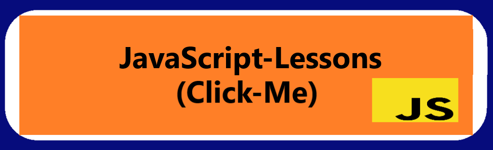

  
# Connect with me

   
 
 
 

   
 
 
 
      
 
 

 

 
<h2 align="center">My Projects</h2>

###Project Demo       |Libraries and Technologies I use     |Project Preview
:-------------------------|-------------------------|-------------------------
[NBA Legends](https://aesthetic-croquembouche-9e333e.netlify.app/) <h3>[Repo](https://github.com/achieve-software/r11nba)</h3> | React |  
[Sass Website Page Design](https://fluffy-brigadeiros-21af96.netlify.app/) <h3>[Repo](https://github.com/achieve-software/6Sass)</h3> | Sass, Scss |-min.gif)
[Is palindrome](https://gentle-babka-dda712.netlify.app/) <h3>[Repo](https://github.com/achieve-software/50-ispalindrome)</h3> | JavaScript, Html, Css |  
[GuessTheNumber Game](https://serene-khapse-2e1043.netlify.app/) <h3>[Repo](https://github.com/achieve-software/3guessnumber)</h3> | JavaScript, Html, Css |
[Appointment Project](https://courageous-puppy-d0bcc3.netlify.app/) <h3>[Repo](https://github.com/achieve-software/r16appoinment-project)</h3> |React |  
[IOS Calculator](https://leafy-heliotrope-83764c.netlify.app/) <h3>[Repo](https://github.com/achieve-software/5IosCalculator)</h3> | JavaScript, Html, Css |  

